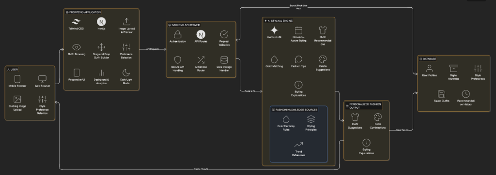
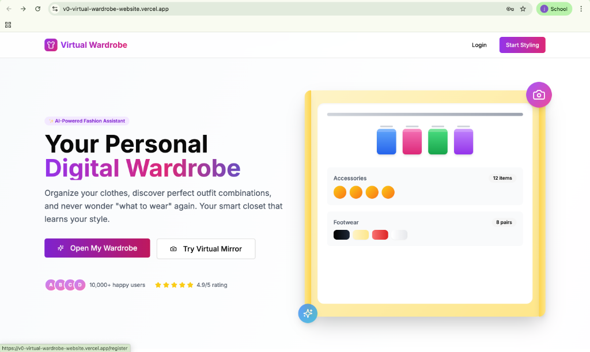
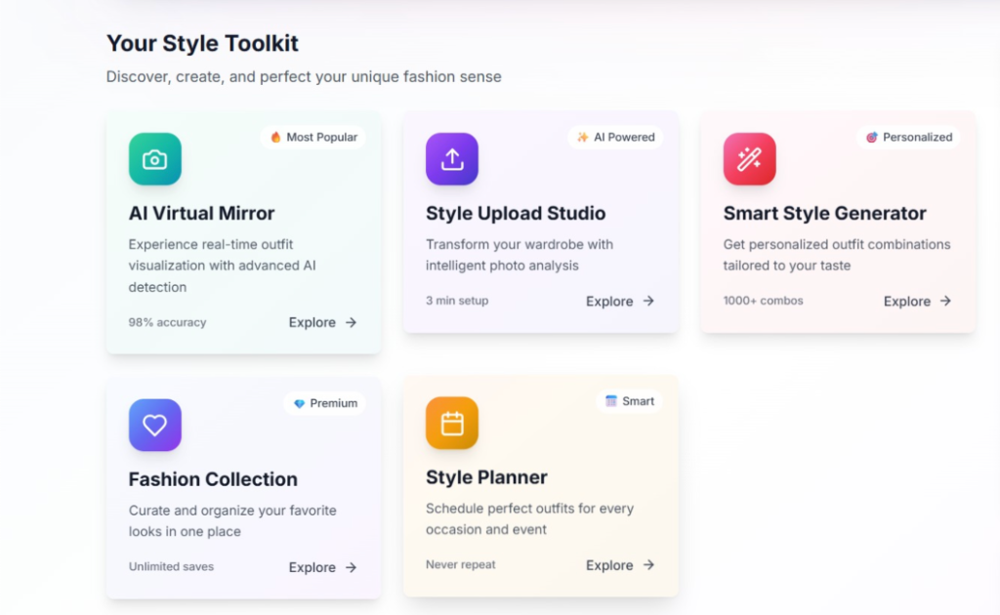
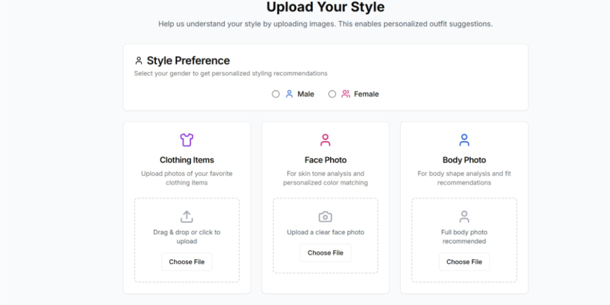
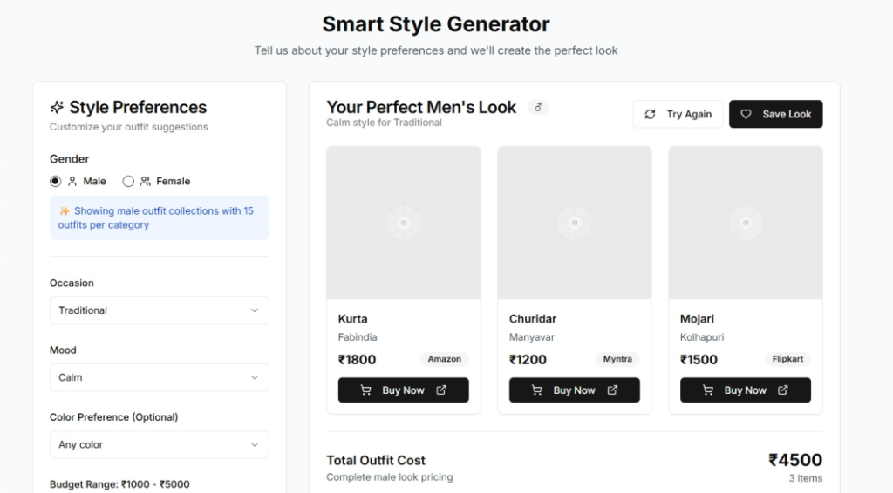
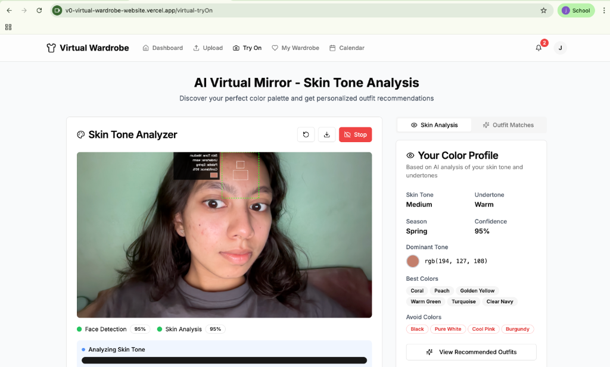

# 👗 Virtual Wardrobe — AI-Powered Digital Style Concierge

> **Sustainable Fashion Meets Artificial Intelligence**
> 
> **Vibe Coding Hackathon 2026** — *Category: AI-Driven Utility & Design*

---

## 🌟 Live Demo & Social Proof
- **🚀 Live Deployment**: [virtual-wardrobe-vibecraft.vercel.app](https://virtual-wardrobe-vibecraft.vercel.app)
- **🎥 Demo Video**: [Watch the 3-minute pitch](https://youtu.be/your-demo-video-id)
- **🐦 Social Thread**: [Check out the X/Twitter Breakdown](https://twitter.com/your-post-id)

---

## 1. Project Overview
**Virtual Wardrobe** is an AI-powered digital closet designed to eliminate the common "I have nothing to wear" dilemma. By digitizing your physical wardrobe, the platform provides personalized outfit recommendations tailored to your personal style, skin tone, and the specific occasion.

Built with a focus on **sustainability**, it encourages users to maximize their existing collection, reducing unnecessary fast-fashion consumption through intelligent recycling and creative styling.

### 🧩 The Problem Statement
In a world of fast fashion, selecting an outfit that matches one’s skin tone, personal style, and occasion is a daily challenge. Most individuals rely on trial and error, leading to wasted time and poor self-image. Existing platforms lack personalization and don't adapt to individual characteristics. **Virtual Wardrobe** bridges this gap using advanced visual input analysis and user-centric AI.

---

## 🏗️ System Architecture & Workflow


The system is built on a **Modular Cloud Architecture** separating the concerns of User Interaction, Data Persistence, and Cognitive AI Analysis.

---

## 🛠️ Technology Stack

### 💻 Core Framework
- **Next.js 15.2.4**: App Router & Server Components for extreme performance.
- **React 19**: Concurrent features and server actions.
- **TypeScript 5**: Strict type safety for enterprise reliability.

### 🎨 UI & Aesthetics
- **Tailwind CSS 3.4**: Utility-first styling with a custom **Glassmorphism** design system.
- **Shadcn UI (Radix Primitives)**: Enterprise-grade accessible components.
- **Lucide React**: Modern iconography.
- **Framer Motion**: Smooth micro-interactions and page transitions.

### 📊 Data & Logic
- **Recharts**: Wardrobe statistics (cost-per-wear, color distributions).
- **Zod + React Hook Form**: Type-safe schema validation.
- **Date-fns**: Lightweight date manipulation.
- **Vaul**: Mobile-first drawer components.

### 🧠 AI Cognitive Layer
- **Gemini 2.0 (via Agentic API)**: Deep reasoning for outfit generation.
- **OpenCV & AI Analysis**: Visual attribute extraction from clothing images.

---

## 📸 Final Outputs & User Journey

### 🏠 The Landing Experience
*A minimalist, premium entry point into your digital closet.*


### 🛠️ Strategic Dashboard
*Real-time wardrobe insights and analytics at a glance.*


### 📤 Smart Upload & Attributes
*AI automatically tags categories, colors, and material properties.*


### 🎨 AI Outfit Generator
*Intelligent styling based on your unique skin tone and occasion.*


### 🎭 Visual Skin Tone Analysis
*Advanced color theory integration for the perfect match.*


---

## 📦 Getting Started

### Prerequisites
- Node.js (v18+)
- **pnpm** (preferred for faster dependency resolution)

### Setup Instructions
1. **Clone the repository**:
   ```bash
   git clone https://github.com/Varshiniamara/Virtual-Wardrobe.git
   cd Virtual-Wardrobe
   ```

2. **Install Dependencies**:
   ```bash
   pnpm install
   ```

3. **Configure Environment**:
   *Create a `.env.local` file with your Gemini/OpenAI API keys.*

4. **Launch Dev Server**:
   ```bash
   pnpm dev
   ```

5. **Visit Locally**:
   Open [http://localhost:3000](http://localhost:3000).

---

## 📝 AI Strategy & Prompt Summary
The project utilized a **Component-Driven AI Strategy**:
- **Role-Based Prompting**: Assigned AI specific roles (e.g., "Senior UI/UX Architect").
- **Iterative Refinement**: A continuous loop of generation, critique, and polishing.
- **Chain of Thought**: Applied to complex logic like the color-theory-based recommender algorithm.

---

## 📂 Source Code Overview
```text
Virtual-Wardrobe/
├── app/              # Next.js App Router (Main Engine)
├── components/       # Shadcn UI & Custom Glass Components
├── hooks/           # State & Logic Management
├── lib/             # AI Utilities & Color Theory Algorithms
├── public/          # Static Design Assets
├── outputs/         # Project Evidence & Documentation Images
└── styles/          # Design Tokens & Tailwind Config
```

---

## 📜 License
This project is licensed under the MIT License. Built for the **Vibe Coding Hackathon 2026**.
